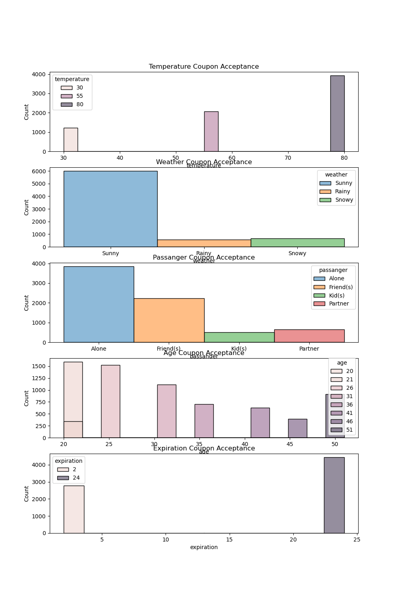
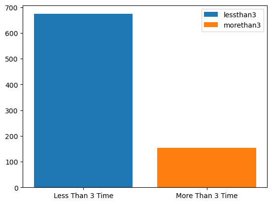

General analysis - 
1. People with no college degree accepted more coupon than rejecting it, other categories had very close acceptance rate but delta of acceptance to rejection was less.

2. Carry out & take away had most coupon acceptance when the temprature is 80 degree , weather is sunny and there was no passanger.

4. Coupons for cheaper resturants , coffee house and carry out & take were accepted most.

5. Percentage of coupon accepted for bar and coffee house - 
  - 56.84 % of total coupan were accepted.
  - 11.47 % of coupan accepted were for bar.
  - 27.67 % of coupan accepted were for coffee house.
6. Acceptance percentage for various categories -
  - Restaurant(<20)  -  27.32 %
  - Coffee House  -  27.67 %
  - Carry out & Take away  -  24.41 %
  - Bar  -  11.47 %
  - Restaurant(20-50)  -  9.13 %

Analysis of Bar coupons - 

- 7210  coupon were accepted.
- 12684  number of observations made.
- 56.84 % of total observations chose to accept the coupon.

Comparison of different criteria and coupon acceptance - 

- 4.0 x more coupon acceptance by people who go to bar less than 3 time in a month when comared to people who go more than 3 time per month.
  
  

- 49.0 % of all the drivers who go to the bar more than once a month are of age over 25.
- 71.0 % of all the drivers who go to the bar more than once a month , had passengers that were not a kid and had occupation other than farming, fishing or forestry.
- 71.32 % of people who go to bar more than once a month and accepted coupon, are didn't had kids or widows as passenger.
- 72.17 % of people who go to bar more than once a month and accepted coupon, are under 30 years old.
- 45.56 % of people who accepted coupon whent to cheaper resturant more than 4 times and income less than $50k.

Analysis of Coffee House coupons - 

-  50.0 % of coffee house coupons were accepted.
-  We found that more coupons were used by drivers visting coffee house more.
-  Coffee house coupons with longer expiration time(1d) are used more than the shorter duration coupon(2h)
-  66.0 % of people who go to coffee house more than once a month and accepted coupon, didn't had kids and are not married.
-  68.63 % of people who go to coffee house more than once a month and accepted coupon, are under 30 years old earning less than 50k annually.     
-  Younger people in all the income groups tend to use coffee house coupon.
-  Drivers visiting the coffee house more than once a month tend to accept the coupon more than others.
-  All different education level had similar ratio of Coffee house coupons acceptance  

